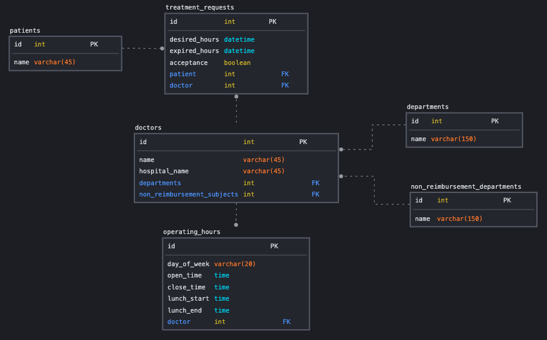

# medical-appointment

# How to use

## 1. Run Virtual Enviroment
```shell
poetry shell
```

## 2. Run Server
```shell
python manage.py runserver
```

# API Description

## 1. 진료 요청
### 엔드포인트

```shell
POST api/v1/treatment_requests
```

### 데이터
```json
{
    "patient": 1,
    "doctor": 1,
    "desired_hours": "2022-1-15 1:00:00"
}

{
    "patient": 2,
    "doctor": 2,
    "desired_hours": "2022-1-11 12:50:00"
}
```

## 2. 진료 요청 검색
### 엔드포인트

```shell
GET /api/v1/doctors/{doctor_id}/treatment_requests
```

## 3. 진료 요청 수락
### 엔드포인트

```shell
POST api/v1/treatment_requests/{treatment_request_id}/accept
```

## 4. 의사 검색 (미구현)
### 엔드포인트

```shell
GET api/v1/doctors
```

# ERD
